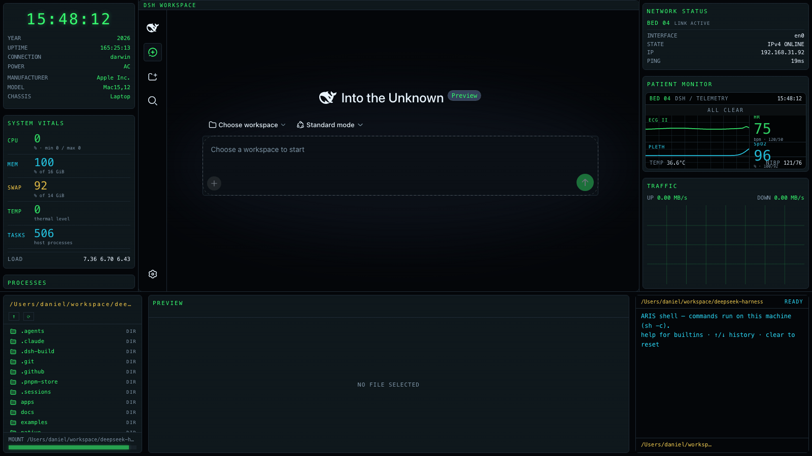
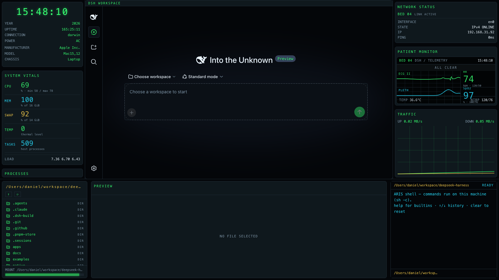

# dsh-edex-icu-ui

**DeepSeek Harness eDEX-UI theme variant — ICU patient monitor.** A clinical
monitor skin for the DSH web GUI, driven by [SimVitals](https://simvitals.diethos.com/)
(free ICU bedside monitor simulator) as a web-discovered design reference: a
near-black blue-green monitor canvas, clinical-green ECG accent `#37ff71`, cyan
`#29dfff` / yellow `#ffd34e` / alarm-red `#d84351` semantic lanes, thin 1px
blue-gray `#1e2a34` card borders with small radii — squared, restrained, flat
(no glow), exactly like the reference.





## Features

- **Featured `PATIENT MONITOR` widget** (replaces the WORLD VIEW globe) — the
  reference's signature element: three waveform lanes (ECG II green, PLETH
  cyan, RESP/CO2 yellow) sweeping over a fine blue-gray grid, per-lane numeric
  readouts (HR / SpO2 / RR with muted limits), a bed/status line (`BED 04`,
  mode, clock), and an alarm band (`ALL CLEAR` steady, red when the host link
  drops)
- **Left bar — `SYSTEM VITALS`** — the host's CPU/memory/swap/thermal/task
  telemetry rendered in the reference's numeric-column language: colored
  labels, big values, muted sub-lines, divider rows
- **`PROCESSES` as scenario cards** — the top-process list restyled as the
  reference's stacked dark-slate selectable cards (bold white title, muted
  detail line)
- **Right bar — bed-status network widget** — green `BED 04` status line plus
  interface/STATE/IP/PING spec lines, and a dual up/down traffic chart
- **Bottom panel** — filesystem browser, file preview/editor, and a real host
  terminal (`runCommand` Remote, history, `cd`/`clear`/`help`), all wearing the
  same 1px card chrome
- **Workspace chrome** — the original DSH UI is framed like every other card:
  a 1px blue-gray border + `DSH WORKSPACE` title strip, on the shared canvas
  color; the workspace itself stays transparent and fully interactive
- **Clinical theme** — token overrides recolor the whole original UI to the ICU
  palette (white primary text, muted slate secondary, green/cyan/yellow/red
  semantics) without touching the user's theme preference; the inherited
  CRT-green Appearance theme is re-themed to the same clinical palette

## Installation

The plugin is published to npm as `@danielng23/dsh-edex-icu-ui`. From the
harness checkout:

```sh
pnpm dsh plugin --profile web add @danielng23/dsh-edex-icu-ui
pnpm dsh web   # serves the themed shell over the default GUI
```

To run the local checkout instead of the npm release (for development), add
the bundle with a `file:` path — its dependency specs link the local
sub-packages:

```sh
pnpm dsh plugin --profile web add file:/path/to/dsh-edex-icu-ui/packages/bundle
```

See [LOCAL_DEVELOPMENT.md](LOCAL_DEVELOPMENT.md) for the build and iteration
workflow.

## Development

See [LOCAL_DEVELOPMENT.md](LOCAL_DEVELOPMENT.md) for the full build, install,
and iteration workflow. The widget architecture for the shell bars is
documented in [WIDGETS.md](WIDGETS.md). The reference analysis this theme was
built from is in [analysis.md](analysis.md) / [analysis.json](analysis.json),
and the review verdict in [review.md](review.md).

## Packages

| Package | Host/Client | Description |
|---|---|---|
| `packages/bundle` | — | Installable bundle (`cordis.patch.yml`) |
| `packages/ui-edex` | client | The themed eDEX shell frame and all panels |
| `packages/ui-theme-terminal` | client | Appearance theme row (ICU palette) |
| `packages/host/system-metrics` | host | System telemetry RPC + file read/write + `runCommand` shell execution |

## License

MIT
